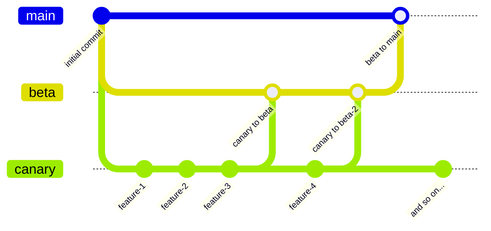

# Contrast Bot
**A versatile Discord bot built with TypeScript and Discord.js**

> [!IMPORTANT]
> ContrastBot is currently offline due to maintenance issues and bugs. As a high school student with limited time, I'm working through code organization challenges. The project isn't abandoned - if you'd like to help get ContrastBot back online, please contribute bug fixes and improvements via pull request to the canary branch.

> [!TIP]
> **Branch Structure**
> - **Main** - Production release branch
> - **Beta** - Testing branch (merges to main when stable)  
> - **Canary** - Development branch (submit all PRs here please)

